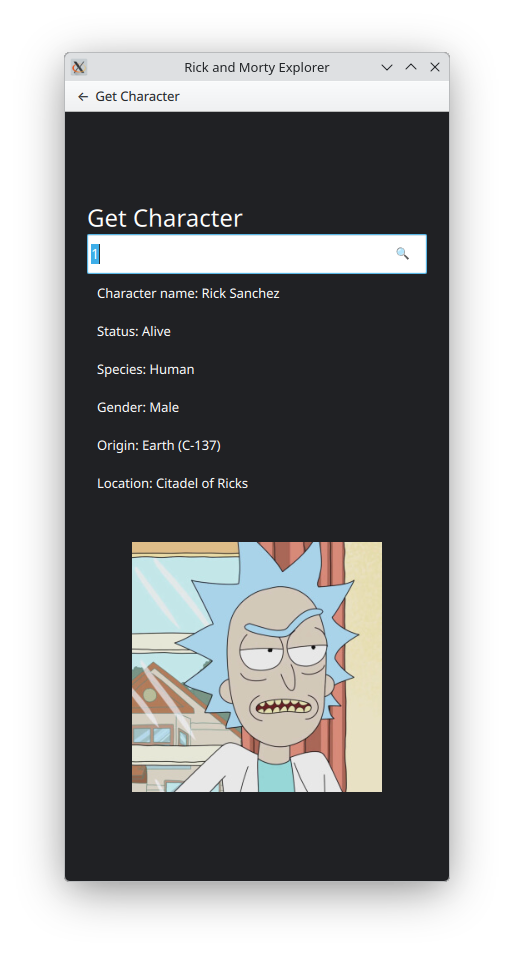
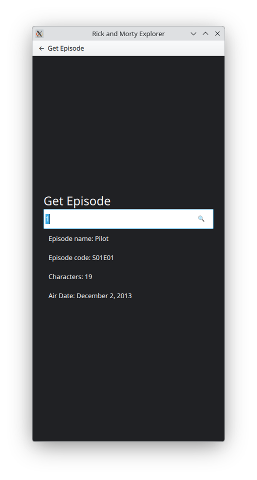

# 🛸 Rick and Morty Explorer

A modern Qt 6 / QML application that consumes the Rick and Morty REST API.

This project was developed as part of a technical assessment and demonstrates REST API integration, asynchronous networking, JSON parsing and a responsive QML user interface.

---

## Features

✅ Retrieve a single character by ID

✅ Retrieve a single episode by ID

✅ Responsive QML interface

✅ Loading indicator

✅ Error handling

✅ Clean MVVM-inspired architecture

---

## Screenshots

### Character

<p align="center">

</p>

### Episode

<p align="center">

</p>

---

## Technologies

- Qt 6
- Qt Quick (QML)
- Qt Network
- C++
- CMake
- REST API
- JSON

---

## API

This application consumes the public Rick and Morty API.

Character endpoint

```
GET /character/{id}
```

Episode endpoint

```
GET /episode/{id}
```

The assessment focuses specifically on retrieving a single character and a single episode by ID, using the official REST endpoints. :contentReference[oaicite:0]{index=0}

---

## Building

```bash
git clone git@github.com:edson-cpp/QmlApp.git

cd QmlApp

cmake -B build

cmake --build build
```

---

## Running

```
./build/QmlApp
```

---

## Project Structure

```
src/
 ├── main.cpp
 ├── ApiClient.cpp
 ├── ApiClient.h

qml/
 ├── Main.qml
 ├── CharacterPage.qml
 ├── EpisodePage.qml

resources/
```

---

## Future Improvements

- Character search by name
- Episode search by code
- Pagination
- Favorites
- Offline cache
- Unit tests

---

## Author

Edson Aguiar
