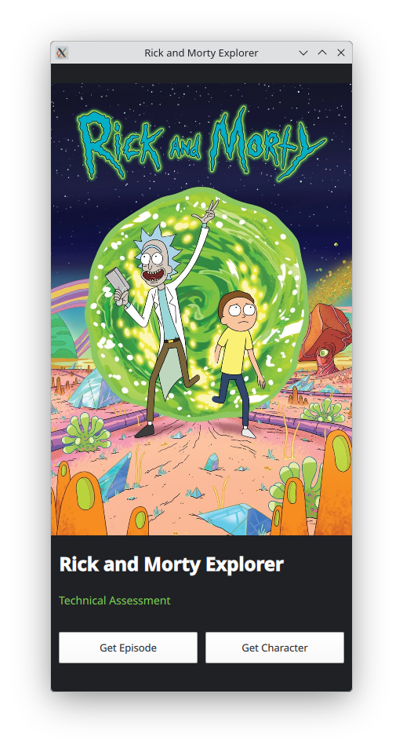

# 🛸 Rick and Morty Explorer

A modern Qt 6 / QML application that consumes the Rick and Morty REST API.

This project was developed as part of a technical assessment and demonstrates REST API integration, asynchronous networking, JSON parsing and a responsive QML user interface.

---

## Features

✅ Retrieve a single character by ID

✅ Retrieve a single episode by ID

✅ Error handling

---

## Screenshots

### Main

<p align="center">

</p>

### Character

<p align="center">

</p>

### Episode

<p align="center">

</p>

---

## Technologies

- Qt 6
- Qt Quick (QML)
- Qt Network
- C++
- CMake
- REST API
- JSON

---

## API

This application consumes the public Rick and Morty API.

Character endpoint

```
GET /character/{id}
```

Episode endpoint

```
GET /episode/{id}
```

The assessment focuses specifically on retrieving a single character and a single episode by ID, using the official REST endpoints.

---

## Building

```bash
git clone git@github.com:edson-cpp/QmlApp.git

Open project on Qt Creator 6

Access Build menu

Click Build Project "QmlApp"
```

---

## Running

```
./build/QmlApp
```

---

## Project Structure

```
 ├── main.cpp
 ├── Main.qml
 ├── Character.qml
 ├── Episode.qml

```

---

## Author

Edson Aguiar
